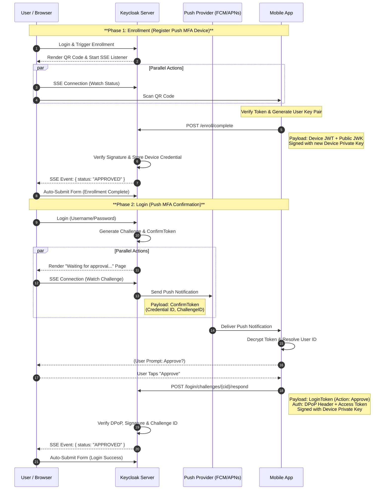

# Keycloak Push MFA Extension

## Introduction

:warning: This project extends Keycloak with a push-style second factor that mimics passkey primitives. After initial enrollment, the mobile app never receives the real user identifier from Keycloak; instead, it works with a credential id that only the app can map back to the real user. Everything is implemented with standard Keycloak SPIs plus a small JAX-RS resource exposed under `/realms/<realm>/push-mfa`.

- Build the provider: `mvn -DskipTests package`
- Run Keycloak locally (imports realm + loads provider): `docker compose up`
- Keycloak admin UI: <http://localhost:8080> (`admin` / `admin`)
- Test realm: `demo` with the user `test / test`

## High Level Flow



1. **Enrollment challenge (RequiredAction):** Keycloak renders a QR code that encodes the realm-signed `enrollmentToken` (the default theme emits `push-mfa-login-app://?token=<enrollmentToken>`, but you can change the URI scheme/payload in your own theme or override the server-side prefix via `--spi-required-action-push-mfa-register-app-uri-prefix=...`). The token is a JWT signed with the realm key and contains user id (`sub`), username, `enrollmentId`, and a Base64URL nonce.

   ```json
   {
     "_comment": "enrollmentToken payload (realm -> device)",
     "iss": "http://localhost:8080/realms/demo",
     "aud": "demo",
     "typ": "push-enroll-challenge",
     "sub": "87fa1c21-1b1e-4af8-98b1-1df2e90d3c3d",
     "username": "test",
     "realm": "demo",
     "enrollmentId": "b15ef7f2-494c-4f03-a9b4-5b7eb4a71caa",
     "nonce": "JYlLk0d9h9zGN7kMd8n5Vw",
     "exp": 1731403200,
     "iat": 1731402900
   }
   ```

2. **Device enrollment response:** The app verifies the token using the realm JWKS, generates a user key pair and `kid`, and posts a JWT back to Keycloak that echoes the nonce and enrollment id, embeds the JWK under `cnf.jwk`, and introduces a credential id (passkey-style). Supply a `deviceId` only when you allow the same user to enroll multiple devices; otherwise use a stable value (for example `primary-device`) so the credential still has a predictable id. The JWT header uses the same `kid` that appears under `cnf.jwk`:

   Header:

   ```json
   {
     "alg": "RS256",
     "typ": "JWT",
     "kid": "user-key-31c3"
   }
   ```

   Payload:

   ```json
   {
     "_comment": "credential enrollment payload (device -> realm)",
     "enrollmentId": "b15ef7f2-494c-4f03-a9b4-5b7eb4a71caa",
     "nonce": "JYlLk0d9h9zGN7kMd8n5Vw",
     "sub": "87fa1c21-1b1e-4af8-98b1-1df2e90d3c3d",
     "deviceType": "ios",
     "pushProviderId": "mock-provider-token",
     "pushProviderType": "log",
     "credentialId": "credential-bf7a9f52",
     "deviceId": "device-3d7a4e65-9bd6-4df3-9c7d-2b3e0ce9e1a5",
     "deviceLabel": "Demo Phone",
     "cnf": {
       "jwk": {
         "kty": "RSA",
         "n": "uVvbx3-...",
         "e": "AQAB",
         "alg": "RS256",
         "use": "sig",
         "kid": "user-key-31c3"
       }
     },
     "iat": 1731402910,
     "exp": 1731403200
   }
   ```

3. **Confirm token delivery:** Every login creates a fresh push challenge. Keycloak signs a `confirmToken` using the realm key and displays/logs it. This token is what would be sent via your push provider (Firebase/FCM in the demo implementation): it contains only the credential id (`credId`), the challenge id (`cid`), the originating client id (and its display name if configured), and the numeric message `typ`/`ver` identifiers so the provider learns nothing about the real user or whether the login ultimately succeeds.

   ```json
   {
     "_comment": "confirmToken payload (realm -> device via push provider such as Firebase/FCM)",
     "iss": "http://localhost:8080/realms/demo",
     "credId": "credential-bf7a9f52",
     "typ": 1,
     "ver": 1,
     "cid": "1a6d6a0b-3385-4772-8eb8-0d2f4dbd25a4",
     "client_id": "test-app",
     "client_name": "Test App",
     "iat": 1731402960,
     "exp": 1731403260
   }
   ```

4. **Login approval:** The device looks up the confirm token’s `credId` (credential id), resolves it to the real Keycloak user id in its secure storage, and signs a JWT (`loginToken`) with the same key pair from enrollment. The payload echoes the challenge id (`cid`), the `credId`, and the desired `action` (`approve`/`deny`) so Keycloak can fully trust the intent because it is covered by the user key signature (no nonce is needed because possession of the key already proves authenticity, and `cid` is unguessable).

  ```json
  {
     "_comment": "login approval payload (device -> realm)",
      "cid": "1a6d6a0b-3385-4772-8eb8-0d2f4dbd25a4",
      "credId": "credential-bf7a9f52",
      "deviceId": "device-3d7a4e65-9bd6-4df3-9c7d-2b3e0ce9e1a5",
      "action": "approve",
      "exp": 1731403020
    }
   ```

   See [DPoP Authentication](#dpop-authentication) for the proof format and how access tokens are obtained.

5. **Browser wait (SSE):** The Keycloak login UI now opens a server-sent events (SSE) stream for the login challenge. Once the SSE status switches away from `PENDING`, the waiting form automatically submits and the flow proceeds. The legacy `GET /push-mfa/login/pending` endpoint is still available for scripts and debugging, but browsers no longer rely on polling.

### Enrollment SSE details

- **Endpoint:** `GET /realms/<realm>/push-mfa/enroll/challenges/{challengeId}/events?secret=<watchSecret>` streams `text/event-stream`. The `watchSecret` is a per-challenge random value stored in `PushChallenge.watchSecret`; it prevents other sessions from observing enrollment progress.
- **Server loop:** `PushMfaResource#emitEnrollmentEvents` runs asynchronously, polls the challenge store every second, and emits a `status` event whenever the challenge state changes or an error occurs. Each event payload is JSON shaped like:

  ```json
  {
    "status": "PENDING | APPROVED | DENIED | NOT_FOUND | FORBIDDEN | INVALID | INTERRUPTED",
    "challengeId": "<uuid>",
    "expiresAt": "2025-11-14T13:16:12.902Z",
    "resolvedAt": "2025-11-14T13:16:22.180Z"
  }
  ```

  Failures (missing secret, secret mismatch, challenge not found, thread interruption, serialization errors) are logged at INFO level so pod logs provide a complete timeline for troubleshooting.

- **Client behavior:** The enrollment page (`push-register.ftl`) spins up a single `EventSource` pointed at the `eventsUrl`. When a non-`PENDING` status arrives the stream is closed and the hidden `check` form is submitted, allowing Keycloak’s RequiredAction to complete without any manual refresh. If the connection drops (pod restart, network flap) the browser’s native EventSource automatically retries; the script only logs `error` events for visibility.

- **No polling fallback:** Unlike earlier iterations the SSE client never schedules timer-based polling. If EventSource is missing (very old browsers) the script simply logs a warning, which is acceptable in this demo because enrollment is expected to run in modern browsers.

### Login SSE details

- **Endpoint:** `GET /realms/<realm>/push-mfa/login/challenges/{cid}/events?secret=<watchSecret>` streams the status for a login challenge. The authenticator generates a fresh `watchSecret` for every login, stores it with the challenge, and exposes the fully qualified SSE URL to the `push-wait.ftl` template via `pushChallengeWatchUrl`.

- **Server loop:** `PushMfaResource#emitLoginChallengeEvents` mirrors the enrollment loop and emits JSON payloads such as:

  ```json
  {
    "status": "PENDING | APPROVED | DENIED | EXPIRED | NOT_FOUND | FORBIDDEN | BAD_TYPE | INVALID | INTERRUPTED",
    "challengeId": "8fb0bc35-3e9f-4a9e-b9c1-5bb0bd963044",
    "expiresAt": "2025-11-17T10:24:11.446Z",
    "resolvedAt": "2025-11-17T10:24:35.100Z",
    "clientId": "account-console"
  }
  ```

- **Client behavior:** The waiting login form starts an `EventSource` and listens for `status` events. As soon as the status changes away from `PENDING`, the stream is closed and the (already prepared) form posts back to Keycloak, resuming the authentication flow without additional HTTP polling. If SSE is unavailable or the connection fails repeatedly, the script falls back to a single delayed form submission so the classic polling logic still works as a safety net.

## Validation Checks by Step

- **Enrollment token / QR:** Keycloak signs the `enrollmentToken` with the realm key and encodes `sub`, `enrollmentId`, `nonce`, and `exp` in the QR. The app should verify the signature against `/realms/demo/protocol/openid-connect/certs` plus issuer/audience/expiry before using it.
- **Complete enrollment (`POST /realms/demo/push-mfa/enroll/complete`):** The server ensures the challenge exists, belongs to the user, and is still `PENDING`, checks `exp` and nonce, requires a supported algorithm and `cnf.jwk`, enforces header/`cnf` algorithm compatibility, and verifies the JWT signature with the posted JWK before persisting the credential id and optional `deviceId`.
- **Confirm token + SSE:** Each login creates a fresh challenge and confirm token signed by the realm key containing only the credential id, `cid`, client id/name, and `exp`. SSE watchers for enrollment/login require the per-challenge `watchSecret` and abort on missing/mismatched secrets or the wrong challenge type before streaming status.
- **DPoP-protected API calls (`/login/pending`, `/login/challenges/{cid}/respond`, `/device/*`):** Keycloak re-verifies the access token, confirms the `cnf.jkt` thumbprint matches the stored JWK, checks the DPoP proof `htm`/`htu`, ensures `iat` is within ±120 seconds, and requires `sub` + `deviceId` to match a stored credential (enforcing the credential’s algorithm) before accepting the request-level DPoP signature.
- **Login approval JWT (`POST /realms/demo/push-mfa/login/challenges/{cid}/respond` body):** After DPoP auth, the login token must match the challenge id, pass signature/`exp` checks against the stored key, carry the correct `credId`, use the expected algorithm, and declare `action` as `approve` or `deny`. If the challenge is bound to a specific credential id, mismatched devices are rejected.

## DPoP Authentication

All push REST endpoints (except enrollment) rely on [OAuth 2.0 Demonstration of Proof-of-Possession (DPoP)](https://datatracker.ietf.org/doc/html/rfc9449) to prove that requests come from the enrolled device:

1. **User key material** is generated during enrollment and stored as a credential on the user. Keep the private key on the device; Keycloak stores the public JWK (and an optional `deviceId` if you let a user enroll more than one device).
2. **Access tokens** are obtained using the device client credentials (`push-device-client`) and an attached DPoP proof. The access token’s `cnf.jkt` claim is bound to the user key’s thumbprint.
3. **API calls** supply both `Authorization: DPoP <access_token>` and a fresh `DPoP` header that contains the HTTP method (`htm`), URI (`htu`), timestamp (`iat`), nonce (`jti`), and the same `sub`/`deviceId` used at enrollment.
4. **Server verification** re-checks the access token signature (using the realm key), ensures the `cnf.jkt` matches the stored JWK, validates the DPoP proof (signature with the user key, method/URL, `sub`/`deviceId`, freshness), and rejects the request if any of those steps fail. The device never sees the realm’s signing key, and Keycloak never sees the private user key.

### DPoP Proof Structure

The proof is a signed JWT:

The header embeds the device’s public JWK and the proof is signed with the corresponding private key:

```json
{
  "alg": "RS256",
  "typ": "dpop+jwt",
  "jwk": {
    "kty": "RSA",
    "n": "…base64…",
    "e": "AQAB",
    "kid": "user-key-31c3"
  }
}
```

Payload:

```json
{
  "htm": "POST",
  "htu": "https://example.com/realms/demo/push-mfa/login/pending?userId=87fa1c21-1b1e-4af8-98b1-1df2e90d3c3d",
  "iat": 1731402960,
  "jti": "6c1f8a0c-4c6e-4d67-b792-20fd3eb1adfc",
  "sub": "87fa1c21-1b1e-4af8-98b1-1df2e90d3c3d",
  "deviceId": "device-3d7a4e65-9bd6-4df3-9c7d-2b3e0ce9e1a5"
}
```

The server rejects proofs if `htm`/`htu` don’t match the actual request, if the `sub` user doesn’t own the `deviceId`, or if the proof’s signature doesn’t verify with the stored JWK.

### Obtaining a DPoP-Bound Access Token

The device creates a proof for the token endpoint (`POST /protocol/openid-connect/token`), signs it with the user key, and includes it via the `DPoP` header while using the device client credentials. Pseudocode:

```bash
REALM_BASE=http://localhost:8080/realms/demo
TOKEN_ENDPOINT="$REALM_BASE/protocol/openid-connect/token"
CLIENT_ID=push-device-client
CLIENT_SECRET=device-client-secret
USER_KEY=./user-private-key.pem
USER_JWK='{"kty":"RSA","n":"...","e":"AQAB","kid":"user-key-31c3"}'

# Create JSON header/payload, base64url-encode, and sign with USER_KEY.
DPoP_PROOF=$(echo -n "<header>.<payload>" | openssl dgst -binary -sha256 -sign "$USER_KEY" | base64urlencode)

curl -s -X POST "$TOKEN_ENDPOINT" \
  -H "DPoP: $DPoP_PROOF" \
  -H "Content-Type: application/x-www-form-urlencoded" \
  -d "grant_type=client_credentials" \
  -d "client_id=$CLIENT_ID" \
  -d "client_secret=$CLIENT_SECRET"
```

The response’s `access_token` is then sent with `Authorization: DPoP <access_token>` on every subsequent API call along with a new DPoP header tailored to the specific endpoint. The token is a standard Keycloak JWT:

Header:

```json
{ "alg": "RS256", "typ": "JWT", "kid": "realm-key-id" }
```

Payload:

```json
{
  "iss": "http://localhost:8080/realms/demo",
  "sub": "service-account-push-device-client",
  "aud": "account",
  "exp": 1763381192,
  "iat": 1763380892,
  "azp": "push-device-client",
  "scope": "email profile",
  "cnf": {
    "jkt": "s3E3x7ARe2vVffo1QOxzWIOh3aDzLzLG4zGz7d5vknU"
  }
}
```

## Custom Keycloak APIs

All endpoints live under `/realms/demo/push-mfa`. Enrollment completion posts the device JWT in the request body, while every other endpoint requires a DPoP header signed with the user key (the structure shown above). Access tokens still come from the device client credentials, but they are DPoP-bound so every request is cryptographically tied to the hardware key material.

### Complete enrollment

```
POST /realms/demo/push-mfa/enroll/complete
Content-Type: application/json

{
  "token": "<device-signed enrollment JWT>"
}
```

Keycloak verifies the signature using `cnf.jwk`, persists the credential (JWK, algorithm, deviceType, `pushProviderId`, `pushProviderType`, credentialId, deviceId, deviceLabel), and resolves the enrollment challenge. The `pushProviderId` value is whatever identifier your push backend requires (for example an FCM registration token or an APNs device token), while `pushProviderType` selects the Keycloak `PushNotificationSender` provider that should deliver the confirm token. The bundled logging implementation exposes the type `log`, which simply prints the payload. Your scripts use `pushProviderType=log` by default, but real deployments can plug in any provider via the [Push Notification SPI](#push-notification-spi). The `deviceLabel` is read from the JWT payload (falls back to `PushMfaConstants.USER_CREDENTIAL_DISPLAY_NAME` when absent).

```json
{
  "status": "enrolled"
}
```

### List pending login challenges

```
GET /realms/demo/push-mfa/login/pending?userId=<keycloak-user-id>
Authorization: DPoP <access-token>
DPoP: <proof JWT>
```

The `DPoP` header carries a short-lived JWT signed with the user key (see the example above). Its payload must include `htm`, `htu`, `iat`, `jti`, plus the custom `sub` (Keycloak user id) and `deviceId`. Keycloak verifies the signature using the stored credential and only returns pending challenges tied to that device id.

```json
{
  "challenges": [
    {
      "userId": "87fa1c21-1b1e-4af8-98b1-1df2e90d3c3d",
      "cid": "1a6d6a0b-3385-4772-8eb8-0d2f4dbd25a4",
      "expiresAt": 1731402972,
      "clientId": "test-app",
      "clientName": "Test App"
    }
  ]
}
```

If the credential referenced by the device assertion does not own an outstanding challenge, the array is empty even if other devices for the same user are awaiting approval.

`expiresAt` is expressed in Unix seconds (the same format used by JWT `exp` claims) so the device can reuse its existing JWT helpers for deadline calculations.

### Approve or deny a challenge

```
POST /realms/demo/push-mfa/login/challenges/{cid}/respond
Authorization: DPoP <access-token>
DPoP: <proof JWT>
Content-Type: application/json

{
  "token": "<device-signed login JWT>"
}
```

Keycloak verifies the DPoP proof to authenticate the device, then validates the login token (stored in the request body) with the saved JWK. The login token must carry `cid`, `credId`, `deviceId`, and `action`. `"action": "approve"` marks the challenge as approved; `"action": "deny"` marks it as denied. Any other value is rejected.

```json
{ "status": "approved" }
```

### Update the push provider

```
PUT /realms/demo/push-mfa/device/push-provider
Authorization: DPoP <access-token>
DPoP: <proof JWT>
Content-Type: application/json

{
  "pushProviderId": "new-provider-token",
  "pushProviderType": "log"
}
```

Keycloak authenticates the request with the current user key and replaces the stored push provider identifier and/or type tied to that credential. The response body is `{ "status": "updated" }` (or `"unchanged"` if the values were already in sync). Use this endpoint whenever your downstream push provider rotates registration tokens (e.g., new FCM registration token, APNs device token refresh, proprietary push subscription id, etc.), or when you want to switch to a different `PushNotificationSender` implementation. Omitting `pushProviderType` keeps the existing type.

> Demo helper: `scripts/update-push-provider.sh <credential-id> <provider-id> [provider-type]`

### Rotate the user key

```
PUT /realms/demo/push-mfa/device/rotate-key
Authorization: DPoP <access-token>
DPoP: <proof JWT>
Content-Type: application/json

{
  "publicKeyJwk": {
    "kty": "RSA",
    "n": "....",
    "e": "AQAB",
    "alg": "RS256",
    "use": "sig",
    "kid": "user-key-rotated"
  },
  "algorithm": "RS256"
}
```

The DPoP proof must be signed with the *existing* user key. After validation, Keycloak swaps the stored JWK/algorithm (and updates the credential timestamp). The response is `{ "status": "rotated" }`. Future API calls must be signed with the newly-installed key.

> Demo helper: `scripts/rotate-user-key.sh <credential-id>`

### Demo CLI scripts

The repository includes thin shell wrappers that simulate a device:

- `scripts/enroll.sh <enrollment-token>` decodes the QR payload, generates a key pair (RSA or EC), and completes enrollment.
- `scripts/confirm-login.sh <confirm-token>` decodes the Firebase-style payload, lists pending challenges (for demo visibility), and approves/denies the challenge.
- `scripts/update-push-provider.sh <credential-id> <provider-id> [provider-type]` updates the stored push provider metadata (defaults to the `log` provider used in this demo).
- `scripts/rotate-user-key.sh <credential-id>` rotates the user key material and immediately persists the new JWK/algorithm.

All scripts source `scripts/common.sh`, which centralizes base64 helpers, compact-JWS signing, DPoP proof creation, and token acquisition. The helper expects `scripts/sign_jws.py` to exist (or `COMMON_SIGN_JWS` to point to a compatible signer), so replacing the demo logic with a real implementation only requires swapping in a different signer.

## Configuration Options

**Where to configure**
- Admin UI: `Authentication → Flows` (open your flow → execution `Config` for the authenticator) and `Authentication → Required Actions` (select `push-mfa-register` → `Configure`).
- CLI: use `kcadm.sh` against the realm DB. Example: `kcadm.sh update authentication/executions/${EXEC_ID} -r demo -s "config.loginChallengeTtlSeconds=180" -s "config.maxPendingChallenges=2"` for the authenticator, or `kcadm.sh update authentication/required-actions/push-mfa-register -r demo -s "config.enrollmentChallengeTtlSeconds=300" -s "config.appUriPrefix=push-mfa-login-app://?token="`.
- Environment variables: none; these values live in realm config, so set them via Admin UI or `kcadm.sh`.

**Authenticator (`push-mfa-authenticator`)**
- `loginChallengeTtlSeconds` (default: `120`) – TTL for login challenges/confirm tokens.
- `maxPendingChallenges` (default: `1`) – maximum concurrent pending login challenges per user.

**Required Action (`push-mfa-register`)**
- `enrollmentChallengeTtlSeconds` (default: `120`) – TTL for enrollment challenges/tokens.
- `appUriPrefix` (default: `push-mfa-login-app://?token=`) – prefix prepended to the enrollment token for companion-app deep links.

## App Implementation Notes

- **Realm verification:** Enrollment starts when the app scans the QR code and reads `enrollmentToken`. Verify the JWT with the realm JWKS (`/realms/demo/protocol/openid-connect/certs`) before trusting its contents.
- **User key material:** Generate a key pair per user (or per device if you let a user enroll more than one), select a unique `kid`, and keep the private key in secure storage. Persist and exchange the public component exclusively as a JWK (the same document posted in `cnf.jwk`). With a single device per user you can reuse a stable `deviceId`; only multi-device setups need distinct ids.
- **Algorithm choice:** The demo scripts default to RSA/RS256 but also support EC keys and ECDSA proofs—set `DEVICE_KEY_TYPE=EC`, pick a curve via `DEVICE_EC_CURVE` (P-256/384/521), and override `DEVICE_SIGNING_ALG` if you need ES256/384/512. The selected algorithm is stored with the credential so Keycloak enforces it for all future DPoP proofs, login approvals, and rotation requests.
- **State to store locally:** credential id ↔ real Keycloak user id mapping, the user key pair, the `kid`, `deviceType`, `pushProviderId`, `pushProviderType`, preferred `deviceLabel`, and any metadata needed to post to Keycloak again. Track a `deviceId` only when you support multiple devices per user.
- **Confirm token handling:** When the confirm token arrives through Firebase (or when the user copies it from the waiting UI), decode the JWT, extract `cid` and `credId`, and either call `/push-mfa/login/pending` (optional) or immediately sign the login approval JWT and post it to `/push-mfa/login/challenges/{cid}/respond`. Use the optional `client_name` claim (when present) to display a friendly app label.
- **Pending challenge discovery:** Before calling `/push-mfa/login/pending`, build a DPoP proof that includes the HTTP method (`htm`), full URL (`htu`), `sub`, `deviceId`, `iat`, and a fresh `jti`, and send it via the `DPoP` header so Keycloak can scope the response to that physical device. The response lists each pending challenge with `clientId` and `clientName`.
- **Access tokens:** Obtain a short-lived access token via the realm’s token endpoint using the device client credentials. The token request itself must include a DPoP proof, and each subsequent REST call must send `Authorization: DPoP <access-token>` alongside a fresh `DPoP` header signed with the same key.
- **Request authentication:** Every REST call (aside from enrollment, which already embeds the user key) must include a DPoP proof signed with the current user key. The proof binds the request method and URL to the hardware-backed key, making replay or reverse-engineering of a shared client secret ineffective.
- **Error handling:** Enrollment and login requests return structured error responses (`400`, `403`, or `404`) when the JWTs are invalid, expired, or mismatched. Surface those errors to the user to re-trigger the flow if necessary.
- **Key rotation / push provider changes:** Use the `/device/push-provider` and `/device/rotate-key` endpoints (described above) to update the stored metadata while authenticating with the current user key. Rotation should generate a fresh key pair, send the public JWK + algorithm, and immediately start using the new key for every subsequent JWT.

## Push Notification SPI

The server emits confirm tokens through the `PushNotificationSender` SPI. Each device credential stores a `pushProviderId` (opaque token/identifier for your push backend) and a `pushProviderType` (the Keycloak SPI provider id). At runtime `PushNotificationService` resolves the SPI implementation by calling `session.getProvider(PushNotificationSender.class, pushProviderType)` and passes in the `pushProviderId`. The bundled `log` provider simply prints the payload, but you can plug in a real APNs/FCM sender by implementing:

```java
public final class MyPushSender implements PushNotificationSender {
    @Override
    public void send(KeycloakSession session,
                     RealmModel realm,
                     UserModel user,
                     String confirmToken,
                     String credentialId,
                     String challengeId,
                     String pushProviderId,
                     String clientId) {
        // Serialize confirmToken into the mobile push message and deliver it via FCM/APNs/etc.
    }
}
```

Create a matching factory:

```java
public final class MyPushSenderFactory implements PushNotificationSenderFactory {
    @Override
    public PushNotificationSender create(KeycloakSession session) {
        return new MyPushSender();
    }
    @Override public String getId() { return "fcm"; }
    // init/postInit/close can remain empty
}
```

Register the factory via the standard service loader file for the SPI you are extending:

```
META-INF/services/de.arbeitsagentur.keycloak.push.spi.PushNotificationSenderFactory
```

Finally, you must store your factory id (for example, `pushProviderType=fcm`) with each credential during enrollment. The runtime resolves the sender solely from that `pushProviderType`, falling back to the built-in `log` sender if it is blank. Demo scripts keep sending `pushProviderType=log`, so they continue using the logging behavior unless you change their configuration.

With these primitives an actual mobile app UI or automation can be layered on top without depending on helper shell scripts.

## Customizing the Keycloak UI

The provider ships with a lightweight theme fragment under `src/main/resources/theme-resources/`. When the extension is built, those assets are copied into the deployed theme so you can either customize them in-place or copy them into your own Keycloak theme module and override the templates via standard theme selection. The bundle contains:

- **Enrollment (Required Action)** – `templates/push-register.ftl` renders the QR code, enrollment token, and SSE watcher while the user finishes onboarding. The markup is fully self-contained: everything is driven by `data-push-*` attributes on the root element plus localized strings from `messages/messages_en.properties`. To restyle the screen, replace the HTML/CSS and keep emitting the same attributes (or call `KeycloakPushMfa.initRegisterPage(...)` manually) so the QR code and SSE wiring continue to function.
- **Login waiting UI** – `templates/push-wait.ftl` powers the “waiting for approval” screen. It subscribes to the challenge SSE endpoint via the same data attributes and optionally shows the confirm token for demo purposes. Swap the layout or remove the token preview altogether; just ensure the `data-push-*` attributes remain if you still rely on `KeycloakPushMfa.initLoginPage(...)`.
- **Terminal pages** – `templates/push-denied.ftl` and `templates/push-expired.ftl` explain why a login stopped (canceled, denied, expired). These files only display localized strings, so they are easy to rebrand or translate by editing the template and updating the corresponding entries in `messages/messages_<locale>.properties`.

All shared browser behavior (SSE handling, QR rendering, clipboard helpers) lives in `resources/js/push-mfa.js`. The script exposes `KeycloakPushMfa.initRegisterPage`, `KeycloakPushMfa.initLoginPage`, and `KeycloakPushMfa.autoInit`, so if you move to a different frontend stack you can reuse those helpers or replace them entirely with your own EventSource/QR logic. Because every UI asset is a regular Keycloak theme resource, you customize them the same way as any other login theme: copy the template/JS/message files into your custom theme folder, adjust them, and point the realm to that theme via the admin console or `keycloak.conf`.

## Security Guarantees and Mobile Obligations

### Security guarantees provided by the extension

- **Signed artifacts end-to-end:** Enrollment and confirm tokens are JWTs signed by realm keys, and device responses are signed with the user key pair. Every hop is authenticated and tamper-evident.
- **Challenge binding:** Enrollment tokens embed a nonce plus enrollment id, and login approvals reference the opaque challenge id (`cid`), so replaying a response for a different user or challenge fails.
- **Limited data exposure:** Confirm tokens carry only the credential id and challenge id, preventing the push channel from learning the user’s identity or whether a login succeeded.
- **Short-lived state:** Challenge lifetime equals every token’s `exp`, so an attacker has at most ~2 minutes to replay data even if transport is intercepted.
- **Key continuity:** The stored `cnf.jwk` couples future approvals to the same hardware-backed key, giving Keycloak a stable signal that a response truly came from the enrolled device.
- **Hardware-bound authentication:** Every REST call is authenticated with a JWT signed by that device’s private key, which is far more secure than distributing an easily reverse-engineered client secret inside the mobile app. Stealing the client binary is no longer enough; the attacker must compromise the device’s key material as well.
- **DPoP-bound access tokens:** Each access token carries a `cnf.jkt` thumbprint that must match the enrolled device’s JWK. The server recomputes the thumbprint from the stored credential and rejects any DPoP proof or access token that doesn’t match, so only the key pair used during enrollment can successfully invoke the APIs.

### Obligations for the mobile application

- **Verify every JWT:** Check issuer, audience, signature, and `exp` on enrollment and confirm tokens before acting. Fetch the realm JWKS over HTTPS and cache it defensively.
- **Protect the user key pair:** Generate it with high-entropy sources, store the private key in Secure Enclave/Keystore/KeyChain, and never export it. Rotate/re-enroll immediately if compromise is suspected.
- **Enforce challenge integrity:** When a confirm token arrives, compare the `cid`, `credId`, and `client_id` against locally stored state and discard anything unexpected or expired.
- **Secure transport:** Call the Keycloak endpoints only over TLS, validate certificates (no user-controlled CA overrides), and pin if your threat model requires it.
- **Harden local state:** Keep the credential id ↔ real user mapping, push provider identifiers/types, and enrollment metadata in encrypted storage with OS-level protection.
- **Surface errors to users:** Treat 4xx responses (expired, invalid signature, nonce mismatch) as security events, notifying the user and requiring a fresh enrollment or login attempt rather than silently retrying.
